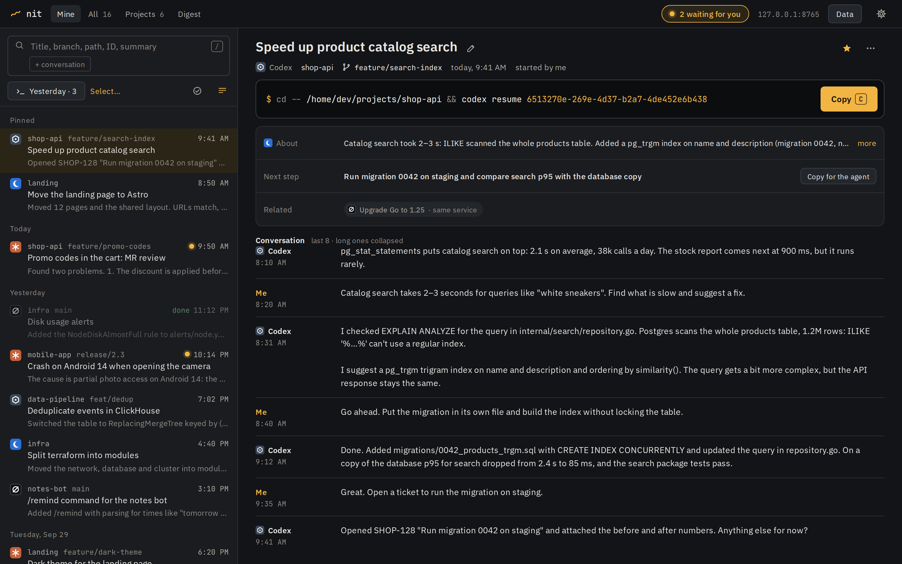
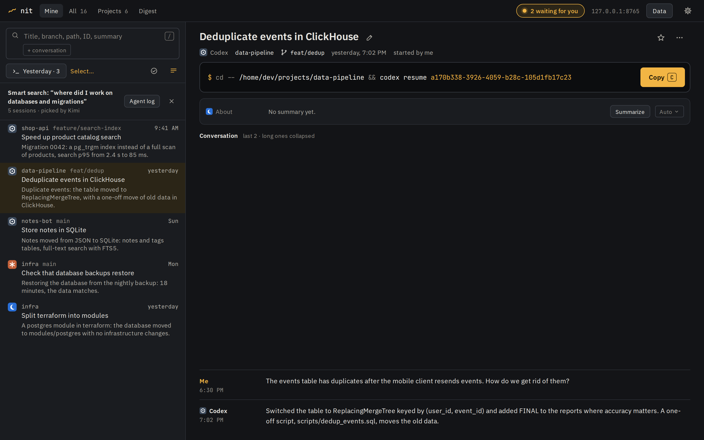
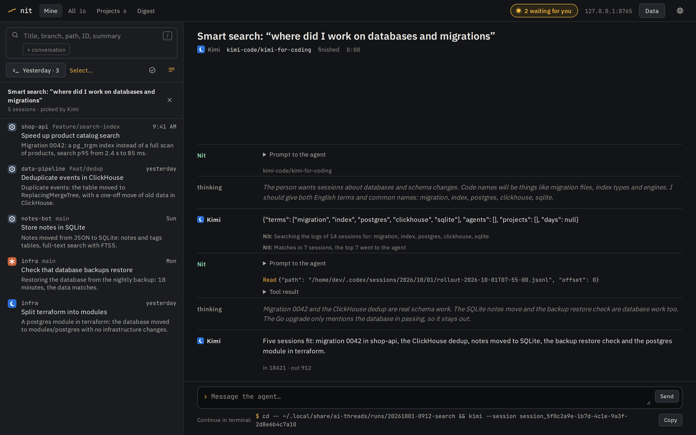
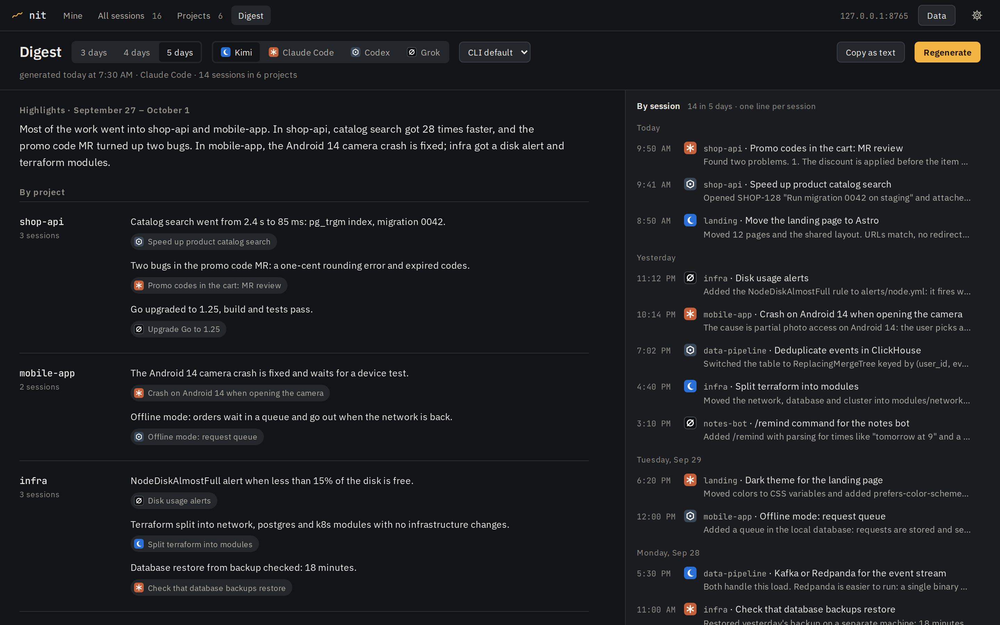
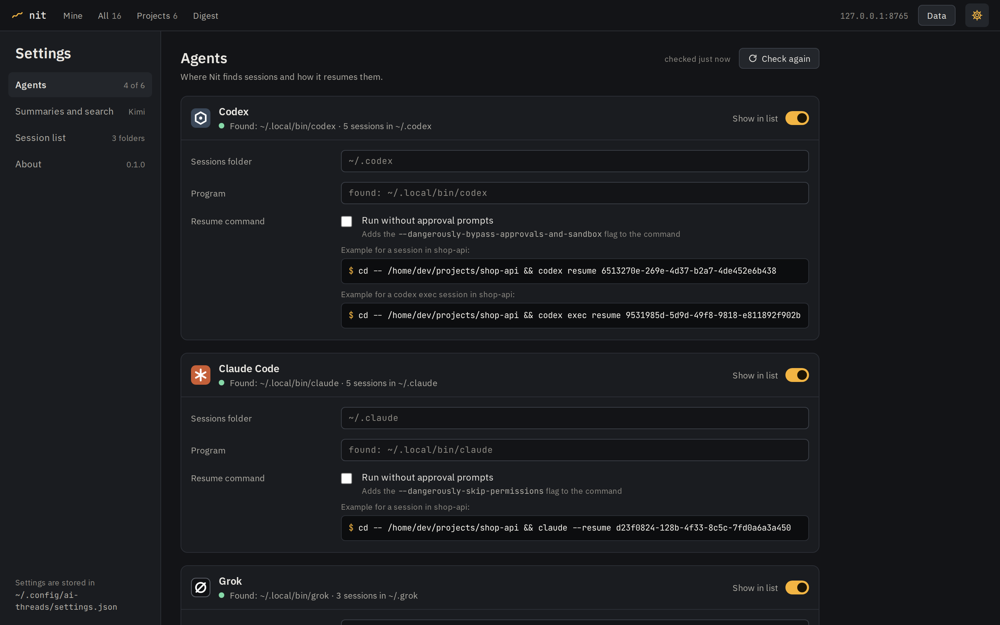

<p align="center"></p>

# Nit

**English** · [Русский](README.ru.md)

Nit (Russian for "thread") is a local web app for finding and resuming coding-agent sessions. It
collects the logs of Claude Code, Codex, Grok, Kimi, ZCode and Cursor Agent into one list, searches
titles and conversations, and gives you the command that resumes a session in your terminal. On
request, an agent writes a summary of one session or of all sessions from the last 3–5 days.

The interface is in English and Russian. Nit follows your browser language and falls back to English;
the `language` [setting](#settings) fixes it.



## Features

- One list of sessions from all agents: project, branch, time, the agent's last reply. You can rename
  a session, pin it to the top, mark it as done or hide it from the list.
- Quick search by title, branch, path, ID and summary. The "+ conversation" toggle also searches the
  conversation text, within the last 512 KB of each log.
- Full log search without an agent: type a query and pick "Search full logs" under the search field,
  or press Enter when the quick search found nothing. Nit reads whole logs, including command output
  and files the agent read, and shows a snippet around each match. It takes a few seconds and shows its
  progress.
- Smart search in plain words: type the request and pick "Ask the agent" under the search field or
  press Ctrl+Enter, for example "find sessions about moving message_profile to partitions in claude
  code and codex". An agent turns the request into search terms plus filters by agent, project
  and date. Nit looks for the terms in the logs, then the agent picks the matching sessions and says why
  each one fits. A one-word query such as a ticket number skips the first step. It usually takes 1–3
  minutes; the sessions found by the terms show up before the agent finishes.
- The agent's work opens on the right, like a session: what Nit sent to the agent, its reasoning when
  the CLI reports it, the files it reads, the commands it runs and its answers, live. When it is done,
  you can write to the agent in the same session, right on the page or in a terminal. The same agent
  log is available for summaries.
- A choice of agent, model and reasoning effort next to "Ask the agent" and "Summarize". By default Nit
  uses what is configured in the CLI, and the model list comes from the CLI itself, so new models show
  up without changing Nit's settings.
- A ready command to resume a session, such as `cd -- <folder> && codex resume <id>`. A checkbox in
  the settings adds the agent's flag for running without approval prompts.
- A script that restores several sessions at once: Windows Terminal tabs (in WSL), tmux windows or
  a plain list of commands. Windows Terminal tabs get the folder and the command from Nit, so Nit must
  be running when you run the script.
- Status of running sessions. For Claude Code, Nit shows whether the agent is working or waiting for
  your reply, and the header counts the sessions waiting for you. For Grok, it shows only that the
  session is running. Other agents do not report their status.
- A session summary: a short title, what was done, the next step and up to three related sessions.
  The Digest page sums up the last 3, 4 or 5 days by project and lists what is left to do.
  Summaries are written by an installed CLI: Kimi, Claude Code, Codex or Grok.
- Automatic runs (`codex exec`, `claude -p`, `grok -p`, `kimi -p`) are not shown in Mine, only in All.
  Other agents usually start them for reviews and summaries, and so does Nit itself.







## Getting started

You need Python 3.10 or newer. The app has no third-party dependencies. Summaries and smart search
also need one of these CLIs: Kimi, Claude Code, Codex or Grok.

```bash
git clone https://github.com/genhoi/ai-threads.git
cd ai-threads
python3 -m ai_threads            # change the port with --port
```

Open http://127.0.0.1:8765 in your browser. On the first start Nit reads all logs, and the list fills
in as it goes.

Tested on Linux and WSL 2. On Windows, run it inside WSL.

## Supported agents

Nit shows the sessions of every agent whose session folder exists. To resume a session or write
summaries, it also needs the agent's program, which it looks for in `PATH`. If the folder or the
program is somewhere else, set the path in the settings.

| Agent | ID | Session folder | Resume command | Flag for `skip_approvals` | Writes summaries |
|---|---|---|---|---|---|
| Codex | `codex` | `~/.codex` (`CODEX_HOME`) | `codex resume {id}` | `--dangerously-bypass-approvals-and-sandbox` | yes |
| Claude Code | `claude` | `~/.claude` (`CLAUDE_HOME`) | `claude --resume {id}` | `--dangerously-skip-permissions` | yes |
| Grok | `grok` | `~/.grok` (`GROK_HOME`) | `grok --resume {id}` | `--always-approve` | yes |
| Kimi | `kimi` | `~/.kimi-code` (`KIMI_CODE_HOME`) | `kimi --session {id}` | `--auto` | yes |
| ZCode | `zcode` | `~/.zcode` (`ZCODE_HOME`) | none: sessions are resumed in the ZCode app | — | no |
| Cursor Agent | `cursor` | `~/.cursor` (`CURSOR_HOME`) | `cursor-agent --resume {id}` | `--force` | no |

Sessions of any agent can be summarized, ZCode and Cursor Agent included. The last column shows which
agents can write the summaries.

Nit only reads the agents' files. One exception: when Nit reads the ZCode and Cursor Agent SQLite
databases in WAL mode, SQLite itself may update the `-shm` file next to the database. The data is not
changed.

## Settings

Change settings on the settings screen (the gear in the header) or in the file
`~/.config/ai-threads/settings.json`. The folder follows `XDG_CONFIG_HOME`, and `AI_THREADS_CONFIG`
sets the full path to the file. The file needs only the values that differ from the defaults. For
example, to resume Codex sessions without approval prompts, have Claude Code write session summaries
and always use the English interface:

```json
{
  "agents": {
    "codex": {"skip_approvals": true}
  },
  "summary": {"agent": "claude"},
  "language": "en"
}
```

In the field names, `<id>` is the agent ID from the table above.

| Field | Default | Meaning |
|---|---|---|
| `agents.<id>.enabled` | `true` | show the agent's sessions |
| `agents.<id>.home` | see the agents table | session folder; the environment variable wins |
| `agents.<id>.program` | found in `PATH` | path to the agent's program |
| `agents.<id>.skip_approvals` | `false` | add the agent's flag for running without approval prompts to the resume command (see the agents table) |
| `open_with` | `auto` | default format of the restore script: `wt`, `tmux` or `plain`. `auto` means Windows Terminal in WSL, otherwise tmux if it is installed, otherwise a plain list |
| `tmux_session` | `nit` | tmux session name in the restore script |
| `summary.agent`, `digest.agent` | `auto` | who writes session summaries and multi-day digests: `kimi`, `claude`, `codex`, `grok`. `auto` picks the first installed one in this order |
| `search.agent` | `auto` | who parses smart search requests and picks sessions; same values |
| `summary.timeout`, `digest.timeout`, `search.timeout` | `300`, `900`, `300` | how many seconds to wait for the agent, from 10 to 7200 |
| `language` | `auto` | interface and summary language: `ru` or `en`. `auto` follows the browser and falls back to English |
| `temp_dirs` | `["/tmp", "/var/tmp", "~/.local"]` | sessions started in these folders or inside them count as temporary and are not shown in Mine |

`open_with` and `tmux_session` are not on the settings screen, only in the file. Environment variables
win over the file: the folder variables from the agents table, and `AI_THREADS_SUMMARY_TIMEOUT`,
`AI_THREADS_DIGEST_TIMEOUT` and `AI_THREADS_SEARCH_TIMEOUT` for timeouts in seconds.

Nit re-reads the file when it changes, no restart needed. If the file has an error, such as broken
JSON, an unknown field or a wrong value, Nit uses the defaults and shows the reason at startup and on
the settings screen.



## Data and privacy

- Your titles, pins, marks, session summaries and multi-day digests are stored in
  `~/.local/share/ai-threads/state.json`. `AI_THREADS_DATA` changes the folder. `cache.json` in the
  same folder is a cache of parsed logs and can be deleted.
- The Data menu in the header exports your titles, pins, marks and session summaries to one
  JSON file and imports them back. Import adds to the current data and deletes nothing, but for a
  session that is already there it replaces the title and the summary with the ones from the file.
  Multi-day digests are not exported: you can compose them again.
- Summaries and smart search run the chosen CLI, which sends data to its model provider, as in regular
  work with that agent.
- For a session summary, the CLI reads the session log, including command output and files the agent
  read. For ZCode and Cursor Agent, Nit passes only the conversation text. The CLI also gets the
  titles of up to 30 other sessions from the same folder over the last 30 days, not counting
  automatic, temporary and hidden ones, to find related sessions.
- For a multi-day digest, the CLI gets the titles, existing summaries and short excerpts of the
  period's sessions, and it may open some of the logs in full.
- For smart search, the CLI gets your request, the project names from the current section (Mine or
  All), and for each of the top 30 candidates: title, summary, first request and up
  to three conversation snippets. Command output and files the agent read are not sent, even if the
  terms were found there.
- Logs go nowhere until you press "Summarize" or "Ask the agent".
- Working folders of these runs are kept for a week in `~/.local/share/ai-threads/runs`: Claude Code
  and Kimi find a session by its folder, and without it you could not write to the agent afterwards.
- The CLI runs without permission to change files: Kimi and Claude Code get only the `Read` tool,
  Codex and Grok run in a read-only sandbox.

## Security

The server listens on `127.0.0.1` only and has no password: any user or program on this machine can
open it. Requests with a foreign `Host` header are rejected. Requests that change data are accepted
only with Nit's own `Origin` header, so a third-party website open in your browser cannot send them.
The browser only passes a session key; the server finds the log path itself.

## Development

```bash
./scripts/setup.sh                      # pytest and Playwright with Chromium and WebKit in .venv
.venv/bin/python -m pytest -q           # all tests; without a browser: --ignore=tests/ui
.venv/bin/python scripts/demo_screenshots.py   # README screenshots from made-up sessions
```

WebKit in WSL needs system libraries: `sudo .venv/bin/python -m playwright install-deps webkit`.
Tests work on copies of the fixtures from `tests/fixtures` and on CLI stubs from `tests/stubs`, and
never touch real logs or data. How the app works and how to add a new agent:
[docs/architecture.md](docs/architecture.md) (in Russian).

## License

[MIT](LICENSE). IBM Plex Sans and JetBrains Mono fonts are under the SIL Open Font License; the
license texts are in `static/fonts/`.
